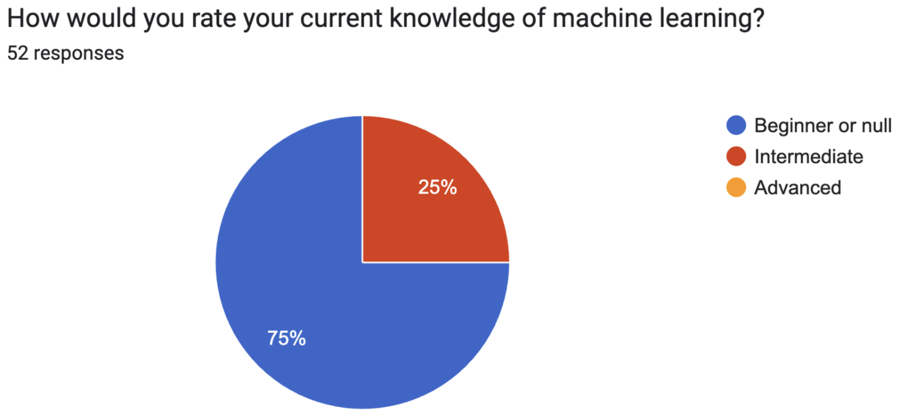
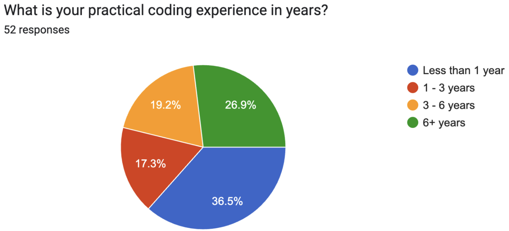
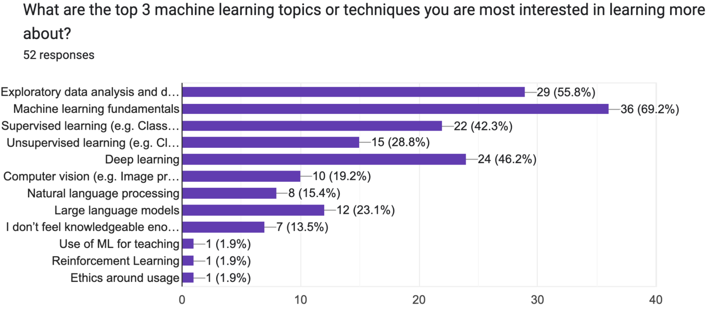
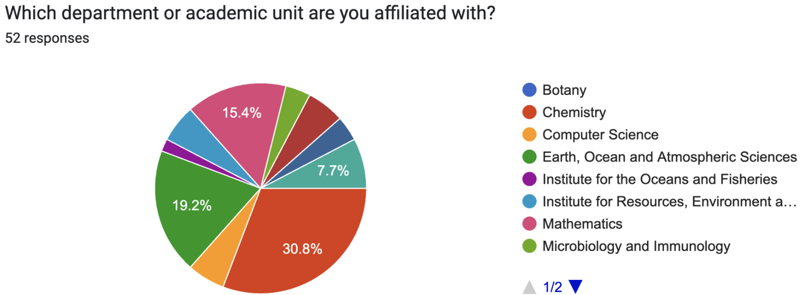

## Welcome to the workshop! {.smaller}
\

- Workshop materials 
  - Website link: https://kvarada.github.io/FoS-Intro-to-ML-2025/
  - Github repo: https://github.com/kvarada/FoS-Intro-to-ML-2025

# 🤝 Introductions 🤝 {.middle}

# Meet your instructors

## Prajeet Bajpai {background="#43464B"}
:::: {.columns}

::: {.column width="20%"}

:::
::: {.column width="80%"}
- Teaching and Learning Postdoctoral Fellow in Computer Science 
- Teaches applied machine learning courses in the Master of Data Science Program (MDS)
- Contact information
    - Email: pbajpai@cs.ubc.ca
:::
::::

## Varada Kolhatkar {background="#43464B"}
:::: {.columns}

::: {.column width="20%"}

:::

::: {.column width="80%"}
- Assistant Professor of Teaching in Computer Science 
- Teaches applied machine learning courses in CS and the Master of Data Science Program (MDS)
- You can call me Varada, **V**, or **Ada**.
- Contact information
    - Email: kvarada@cs.ubc.ca
    - Office: ICCS 237
:::
::::

## Talk to your neighbour

- Take 15 seconds to introduce yourself to your neighbour.  
- Just your name, your department, and maybe one thing you hope to learn today.

# Pre-survey results 

## 

## 

## 

## 

## Learning goals of the workshop 
\

The main goal today is to help you figure out whether machine learning is suitable for your project. By the end of this workshop, you should be able to:

- Recognize different types of ML.
- Understand what kinds of problems ML is good for.
- Start thinking about how ML could fit into your research, if at all.

## Agenda {.smaller}
- We will have four modules in the workshop
  - **Module 1:** Introduction
  - **Module 2:** Machine learning fundamentals 
  - **Module 3:** Commonly used machine learning models 
  - **Module 4:** Introduction to deep learning
  - **Module 5:** Using pre-trained models and embeddings
- Most modules will include hands-on exercises to reinforce learning.
- We'll also make sure to take some breaks in between sessions. 
- The lunch break will be around 12:30, and lunch will be provided!

## Source of the website 
- We are using Quarto to create slides, with live code running in the background. 
- You can access the source for this website and our slides on this GitHub page [https://github.com/kvarada/FoS-Intro-to-ML-2025](https://github.com/kvarada/FoS-Intro-to-ML-2025)

# Let's get started! Buckle up and enjoy the ride! 

