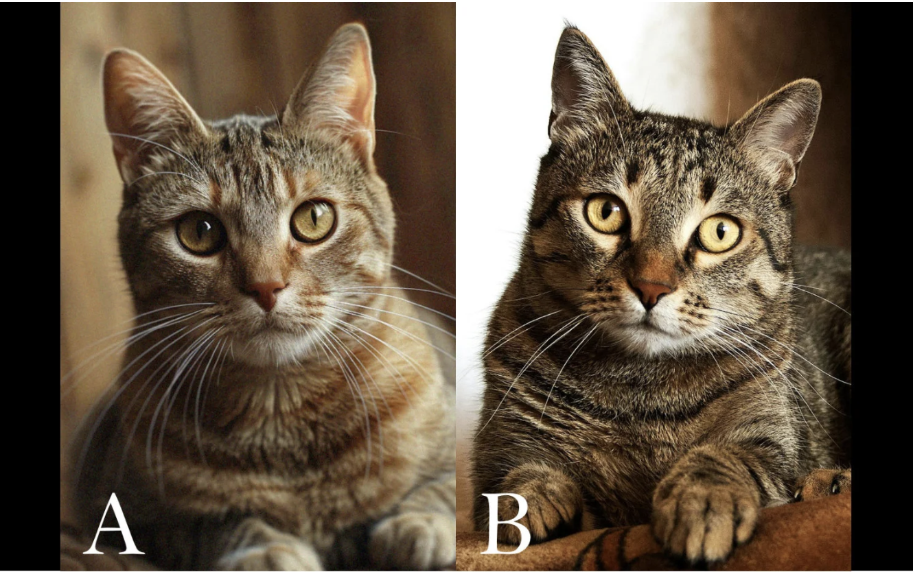
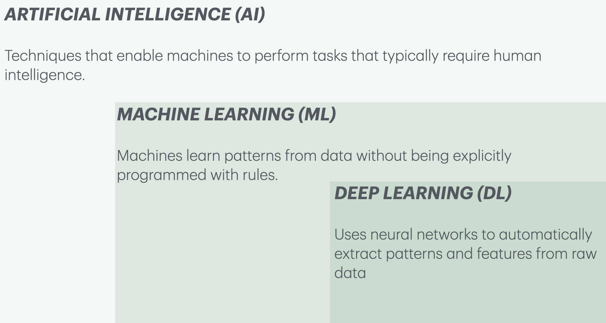

```{python}
import numpy as np
import pandas as pd
import matplotlib.pyplot as plt
import os
import sys
sys.path.append(os.path.join(os.path.abspath("."), "code"))
from plotting_functions import *
from unsupervised_learning_code import *
from IPython.display import HTML, display
from sklearn.feature_extraction.text import CountVectorizer
from sklearn.linear_model import LogisticRegression
from sklearn.model_selection import train_test_split
from sklearn.pipeline import make_pipeline

plt.rcParams["font.size"] = 16
pd.set_option("display.max_colwidth", 200)
%matplotlib inline

DATA_DIR = 'data/' 
```

## 🎯 Learning Outcomes {.smaller}

By the end of this module, you will be able to:
- Explain the difference between traditional programming, machine learning, and deep learning approaches.
- Describe what machine learning is and when it is appropriate to use ML-based solutions.
- Identify different types of machine learning problems, such as classification, regression, clustering, and time series forecasting.
- Recognize common data types in machine learning, including tabular, text, and image data.
- Evaluate whether a machine learning solution is suitable for your problem or whether a rule-based or human-expert solution is more appropriate.

## Which cat do you think is AI-generated? {.smaller}

:::: {.columns}
::: {.column width="60%"}



[Source](https://thinktan.net/are-you-sure-this-photo-is-not-ai-generated/)
:::

::: {.column width="40%"}

- A
- B
- Both
- None

:::
:::: 
- What clues did you use to decide?

## What is AI, ML, DL? {.smaller}
- **Artificial Intelligence (AI)**: Making computers act smart
- **Machine Learning (ML)**: Learning patterns from data
- **Deep Learning (DL)**: Using neural networks to learn complex patterns

{.nostretch fig-align="center" width="700px"}

## Let's walk through an example 

- Have you used search in Google Photos? You can search for "cat" and it will retrieve photos from your libraries containing cats.
- This can be done using **image classification**. 

## Image classification {.smaller}
- Imagine we want a system that can tell cats and foxes apart.
- How might we do this with traditional programming? With ML?

:::: {.columns}

::: {.column width="40%"}
 
:::

::: {.column width="60%"}

| Image ID | Whiskers Present | Ear Size  | Face Shape | Fur Color  | Eye Shape   | Label |
|----------|------------------|-----------|------------|------------|-------------|-------|
| 1        | Yes              | Small     | Round      | Mixed      | Round       | Cat   |
| 2        | Yes              | Medium    | Round      | Brown      | Almond      | Cat   |
| 3        | Yes              | Large     | Pointed    | Red        | Narrow      | Fox   |
| 4        | Yes              | Large     | Pointed    | Red        | Narrow      | Fox   |
| 5        | Yes              | Small     | Round      | Mixed      | Round       | Cat   |
| 6        | Yes              | Large     | Pointed    | Red        | Narrow      | Fox   |
| 7        | Yes              | Small     | Round      | Grey       | Round       | Cat   |
| 8        | Yes              | Small     | Round      | Black      | Round       | Cat   |
| 9        | Yes              | Large     | Pointed    | Red        | Narrow      | Fox   |

::: 

::::


## Traditional programming: example

:::: {.columns}

::: {.column width="40%"}
 
:::

::: {.column width="60%"}
- You hard-code rules. If all of the following satisfy, it's a fox.     
    - pointed face ✅
    - red fur ✅
    - narrow eyes ✅    
- This works for normal cases, but what if there are exceptions
::: 

::::

## ML approach: example

:::: {.columns}

::: {.column width="50%"}
 
:::

::: {.column width="50%"}
- We don't tell the model the exact rule. Instead, we give it many labeled images, and it learns probabilistic patterns across multiple features, not rigid rules.
    - If fur is red $\rightarrow$ 90% chance of Fox.

::: 

::::

## DL approach: example 

:::: {.columns}

::: {.column width="40%"}
 
:::

::: {.column width="60%"}
- A neural network automatically learns which features to look at (edges $\rightarrow$ textures $\rightarrow$ objects).
- No need to even specify face shape or fur colour. It learns relevant features on its own. 
::: 

::::

## What is ML? 

- Learn patterns from examples (data)
- Make predictions, identify patterns, generate content
- ML systems **improve over time** with more data
- No single model fits all problems

## Traditional programming vs. ML

| Approach                 | Best for                                 |
|--------------------------|-------------------------------------------|
| Traditional Programming  | Rules are known, data is clean/predictable |
| Machine Learning         | Rules are complex/unknown, data is noisy  |

## When to use ML? 

- When the problem can't be solved with a fixed set of rules
- When you have **lots of data** and **complex relationships**
- When human decision-making is too slow or inconsistent

# When to use Machine Learning (ML) solutions? 

## Example: Supervised classification {.smaller}
- We want to predict liver disease from tabular features:
```{python}
df = pd.read_csv(DATA_DIR + "indian_liver_patient.csv")
df = df.drop(columns=["Gender"])
df["Dataset"] = df["Dataset"].replace(1, "Disease")
df["Dataset"] = df["Dataset"].replace(2, "No Disease")
df.rename(columns={"Dataset": "Target"}, inplace=True)
train_df, test_df = train_test_split(df, test_size=4, random_state=42)
X_train = train_df.drop(columns=["Target"])
y_train = train_df["Target"]
X_test = test_df.drop(columns=["Target"])
y_test = test_df["Target"]
HTML(train_df.head().to_html(index=False))
```

## Model training 
```{python}
#| echo: true
from lightgbm.sklearn import LGBMClassifier
model = LGBMClassifier(random_state=123, verbose=-1)
model.fit(X_train, y_train)
```

## New examples 

- Given features of new patients below we'll use this model to predict whether these patients have the liver disease or not.
```{python}
HTML(X_test.reset_index(drop=True).to_html(index=False))
```

## Model predictions on new examples {.smaller}
- Let's examine predictions

```{python}
#| echo: true
pred_df = pd.DataFrame({"Predicted_target": model.predict(X_test).tolist()})
df_concat = pd.concat([pred_df, X_test.reset_index(drop=True)], axis=1)
HTML(df_concat.to_html(index=False))
```

## Example: Supervised regression {.smaller}

Suppose we want to predict housing prices given a number of attributes associated with houses. The target here is **continuous** and not **discrete**. 

```{python}
df = pd.read_csv( DATA_DIR + "kc_house_data.csv")
df = df.drop(columns = ["id", "date"])
df.rename(columns={"price": "target"}, inplace=True)
train_df, test_df = train_test_split(df, test_size=0.2, random_state=4)
HTML(train_df.head().to_html(index=False))
```

## Building a regression model

```{python}
#| echo: true
from lightgbm.sklearn import LGBMRegressor

X_train, y_train = train_df.drop(columns= ["target"]), train_df["target"]
X_test, y_test = test_df.drop(columns= ["target"]), train_df["target"]

model = LGBMRegressor()
model.fit(X_train, y_train);
```

## Predicting prices of unseen houses {.smaller}

```{python}
#| echo: true
pred_df = pd.DataFrame(
    {"Predicted_target": model.predict(X_test[0:4]).tolist()}
)
df_concat = pd.concat([pred_df, X_test[0:4].reset_index(drop=True)], axis=1)
HTML(df_concat.to_html(index=False))
```
We are predicting **continuous values** here as apposed to discrete values in `disease` vs. `no disease` example. 


# Text data 

## Example: Text classification {.smaller}

- Suppose you are given some data with labeled spam and non-spam messages and you want to predict whether a new message is spam or not spam.  

::: panel-tabset
### Code

```{python}
#| echo: true
sms_df = pd.read_csv(DATA_DIR + "spam.csv", encoding="latin-1")
sms_df = sms_df.drop(columns = ["Unnamed: 2", "Unnamed: 3", "Unnamed: 4"])
sms_df = sms_df.rename(columns={"v1": "target", "v2": "sms"})
train_df, test_df = train_test_split(sms_df, test_size=0.10, random_state=42)
```

### Output {.smaller}

::: {.scroll-container style="overflow-y: scroll; height: 400px;"}

```{python}
HTML(train_df.head().to_html(index=False))
```
:::
:::

## Let's train a model 

```{python}
#| echo: true
X_train, y_train = train_df["sms"], train_df["target"]
X_test, y_test = test_df["sms"], test_df["target"]
clf = make_pipeline(CountVectorizer(max_features=5000), LogisticRegression(max_iter=5000))
clf.fit(X_train, y_train) # Training the model
```

## Unseen messages {.smaller}

- Now use the trained model to predict targets of unseen messages:

```{python}
pd.DataFrame(X_test[0:4])
```

## Predicting on unseen data {.smaller}

**The model is accurately predicting labels for the unseen text messages above!**

```{python}
pred_dict = {
    "sms": X_test[0:4],
    "spam_predictions": clf.predict(X_test[0:4]),
}
pred_df = pd.DataFrame(pred_dict)
pred_df.style.set_properties(**{"text-align": "left"})
```

## Examplel: Text classification with LLMs
\ 

```{python}
#| echo: true
from transformers import pipeline, AutoModelForTokenClassification, AutoTokenizer
# Sentiment analysis pipeline
analyzer = pipeline("sentiment-analysis", model='distilbert-base-uncased-finetuned-sst-2-english')
analyzer(["I asked my model to predict my future, and it said '404: Life not found.'",
          '''Machine learning is just like cooking—sometimes you follow the recipe, 
            and other times you just hope for the best!.'''])
```


## Zero-shot learning {.smaller}
\

- Now suppose you want to identify the emotion expressed in the text rather than just positive or negative. 

::: {.scroll-container style="overflow-y: scroll; height: 400px;"}
```{python}
from datasets import load_dataset

dataset = load_dataset("dair-ai/emotion")
exs = dataset["test"]["text"][0:10]
exs
```
:::

## Zero-shot learning for emotion detection 
\

```{python}
#| echo: true
from transformers import AutoTokenizer
from transformers import pipeline 
import torch

#Load the pretrained model
model_name = "facebook/bart-large-mnli"
classifier = pipeline('zero-shot-classification', model=model_name)
exs = dataset["test"]["text"][10:20]
candidate_labels = ["sadness", "joy", "love","anger", "fear", "surprise"]
outputs = classifier(exs, candidate_labels)
```

## Zero-shot learning for emotion detection {.smaller}
\

::: {.scroll-container style="overflow-y: scroll; height: 400px;"}
```{python}
pd.DataFrame(outputs)
```
:::

# Image data

## Example: Predicting labels of a given image {.smaller}
- Suppose you have a bunch of animal images. You do not have any labels associated with them and you want to predict labels of these images. 
- We can use machine learning to predict labels of these images using a technique called **transfer learning**. 

::: {.scroll-container style="overflow-y: scroll; height: 400px;"}

```{python}
import img_classify
from PIL import Image
import glob
import matplotlib.pyplot as plt
# Predict topn labels and their associated probabilities for unseen images
images = glob.glob(DATA_DIR + "test_images/*.*")
class_labels_file = DATA_DIR + 'imagenet_classes.txt'
for img_path in images:
    img = Image.open(img_path).convert('RGB')
    img.load()
    plt.imshow(img)
    plt.show();    
    df = img_classify.classify_image(img_path, class_labels_file)
    print(df.to_string(index=False))
    print("--------------------------------------------------------------")
```
:::
:::

# Clustering images
## Finding groups in food images 
\
```{python}
data_dir = "data/food/train"
file_names = [image_file for image_file in glob.glob(data_dir + "/*/*.jpg")]
n_images = len(file_names)
BATCH_SIZE = n_images  # because our dataset is quite small
food_inputs, food_classes = read_img_dataset(data_dir, BATCH_SIZE)
X_food = food_inputs.numpy()
plot_sample_imgs(food_inputs[0:24,:,:,:])
```

## K-Means on food dataset
\

```{python}
#| echo: true
densenet = models.densenet121(weights="DenseNet121_Weights.IMAGENET1K_V1")
densenet.classifier = torch.nn.Identity()  # remove that last "classification" layer
```

```{python}
#| echo: true
Z_food = get_features_unsup(densenet, food_inputs)
k = 5
km = KMeans(n_clusters=k, n_init='auto', random_state=123)
km.fit(Z_food)
```

## Examining food clusters
\

::: {.scroll-container style="overflow-y: scroll; height: 400px;"}

```{python}
#| echo: true
for cluster in range(k):
    get_cluster_images(km, Z_food, X_food, cluster, n_img=6)

```
:::

## Example: Finding most similar items

- Consider the following titles and queries. 
```{python}
#| echo: true
# Corpus of existing paper titles or abstracts
corpus = [
    "Mapping eelgrass beds in British Columbia using remote sensing",
    "Bayesian optimization for reaction discovery and yield improvement",
    "RNA-seq analysis of microbiome interactions and infection susceptibility",
    "Using YOLOv8 for automatic object detection in microscopy images",
    "Anomaly detection in ocean temperature sensor data with machine learning",
    "Embedding-based literature recommendation using scientific abstracts"
]

# List of new queries to compare
queries = [
    "Predicting yield of chemical reactions using optimization techniques",
    "Tracking changes in marine vegetation through drone imagery",
    "Detecting patterns of infection from gene expression data",
    "Literature discovery using sentence embeddings and neural search",
    "Outlier detection in sensor measurements from ocean buoys"
]
```

## Which queries are similar to which titles? 

```{python}
#| echo: true
from sentence_transformers import SentenceTransformer, util
import numpy as np

# Load the MiniLM model
model = SentenceTransformer('sentence-transformers/all-MiniLM-L6-v2')

# Encode corpus and queries
corpus_embeddings = model.encode(corpus, convert_to_tensor=True).cpu()
query_embeddings = model.encode(queries, convert_to_tensor=True).cpu()

# Set number of top matches to show
top_k = 1
```

## Which queries are similar to which titles? 

::: {.scroll-container style="overflow-y: scroll; height: 400px;"}

```{python}
# Loop over queries and find top match(es)
for idx, (query, query_embedding) in enumerate(zip(queries, query_embeddings)):
    print(f"\n🔍 Query {idx+1}: {query}")
    scores = util.cos_sim(query_embedding, corpus_embeddings)[0]
    top_results = np.argpartition(-scores, range(top_k))[:top_k]

    for rank, corpus_idx in enumerate(top_results):
        print(f"   ➤ Match {rank+1}: {corpus[corpus_idx]}")
        print(f"     Cosine similarity: {scores[corpus_idx]:.4f}")
```
:::

# Other commonly occurring problems

## Example: Customer Churn 
- Imagine that you are working for a subscription-based telecom company.
- They want to predict when a specific customer will churn so that they can come up with retention strategies for different customer segments.
- We want to model "time to churn" to understand different factors affecting customer churn.
- Is it possible to use machine learning to predict whether a specific customer will churn?


## Customer Churn Dataset {.smaller}

- Let's look at [Customer Churn Dataset](https://www.kaggle.com/datasets/blastchar/telco-customer-churn), which is collected at a fixed time.

```{python}
df = pd.read_csv(DATA_DIR + "WA_Fn-UseC_-Telco-Customer-Churn.csv")
train_df, test_df = train_test_split(df, random_state=123)
train_df["Churn"] = train_df["Churn"].map({"Yes": 1, "No": 0})
train_df.head(4)
```

## Customer Churn Dataset {.smaller}

- What's different here compared to predicting disease vs. no disease? 
- Here, we are actually interested in the time until the event of churn is likely to occur.

```{python}
train_df[["tenure", "Churn"]].head()
```

## Probability of survival {.smaller}

```{python}
import lifelines
kmf = lifelines.KaplanMeierFitter()
T = train_df["tenure"]
E = train_df["Churn"]
senior = train_df["SeniorCitizen"] == 1

ax = plt.subplot(111)

kmf.fit(T[senior], event_observed=E[senior], label="Senior Citizens")
kmf.plot_survival_function(ax=ax)

kmf.fit(T[~senior], event_observed=E[~senior], label="Non-Senior Citizens")
kmf.plot_survival_function(ax=ax)

plt.ylim(0, 1)
plt.xlabel("Time with service (months)")
plt.ylabel("Survival probability");
```

## Example: Time series 

```{python}
import mglearn

citibike = mglearn.datasets.load_citibike()
X = (
    citibike.index.astype("int64").values.reshape(-1, 1) // 10 ** 9
)  # convert to POSIX time by dividing by 10**9
y = citibike.values
citibike.head()
```

```{python}
plt.figure(figsize=(10, 4))
xticks = pd.date_range(start=citibike.index.min(), end=citibike.index.max(), freq="D")
plt.xticks(xticks, xticks.strftime("%a %m-%d"), rotation=90, ha="left", fontsize=10)
plt.plot(citibike, linewidth=1)
plt.xlabel("Date")
plt.ylabel("Rentals");
plt.title("Number of bike rentals over time for a selected bike station");
plt.show()
```

## Train and test data 

```{python}

n_train = 184
train_df = citibike[:
184]
test_df = citibike[184:]
y_train = train_df.values
y_test = test_df.values
plt.figure(figsize=(10, 3))
train_df_sort = train_df.sort_index()
test_df_sort = test_df.sort_index()

plt.plot(train_df_sort, "b", label="train")
plt.plot(test_df_sort, "r", label="test")
plt.xticks(rotation="vertical")
plt.legend();
plt.show()
```

## Predictions

```{python}
from sklearn.ensemble import RandomForestRegressor
regressor = RandomForestRegressor(n_estimators=100, random_state=0)
X_hour_week = np.hstack(
    [
        citibike.index.dayofweek.values.reshape(-1, 1),
        citibike.index.hour.values.reshape(-1, 1),
    ]
)
eval_on_features(X_hour_week, y, regressor, xticks, feat_names = "hour of day + day of week")
plt.show()
```

# Interactive: Is ML appropriate?

## Exercise 1.1: ML or not?

**Select all that apply: Which problems are suitable for ML?**

- (A) Automatically classifying microscope images of tissue samples into cell types
- (B) Assisting researchers in finding relevant scientific papers for a literature review
- (C) Determining authorship disputes in multi-author publications
- (D) Detecting anomalies in sensor data from an environmental monitoring station
- (E) Predicting the likelihood of a chemical reaction yielding a desired compound

## Summary: When is ML suitable?

| **Approach**     | **Best Used When...**                                                                 |
|------------------|----------------------------------------------------------------------------------------|
| **Machine Learning** | The dataset is **large and complex**, and the decision rules are **unknown, fuzzy, or too complex to define explicitly** |
| **Rule-based System** | The logic is **clear and deterministic**, and the rules or thresholds are **known and stable** |
| **Human Expert**  | The problem involves **ethics, creativity, emotion, or ambiguity** that can't be formalized easily |

## Activity 1: ML in Your Domain

Think of a problem from your own research that could be solved using ML and write it down. Address the following:

- What are you trying to accomplish? What would be the input and output? 
- What would success look like?
- How do humans solve this now? Are there heuristics or rules?
- What kind of data do you have or could you collect?

We'll revisit this activity later to explore how you might frame your problem using ML approaches.
