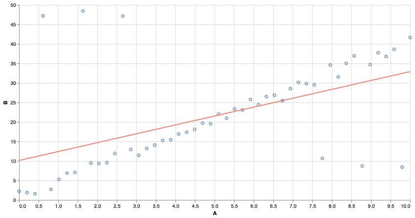
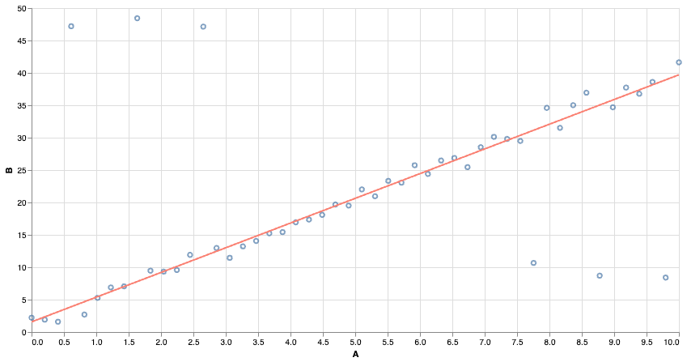
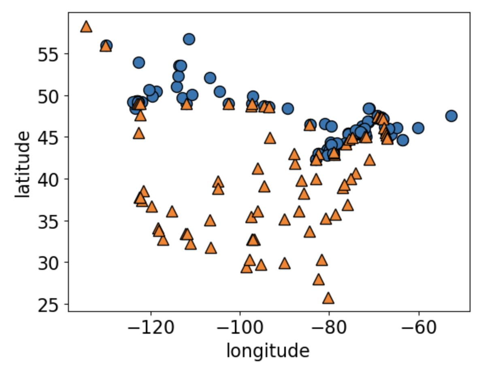
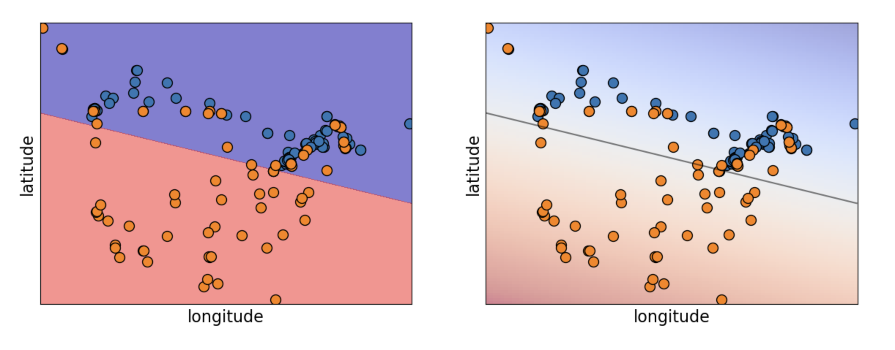
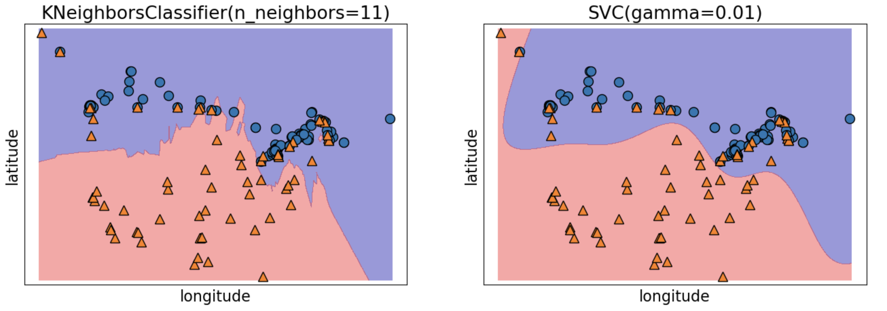
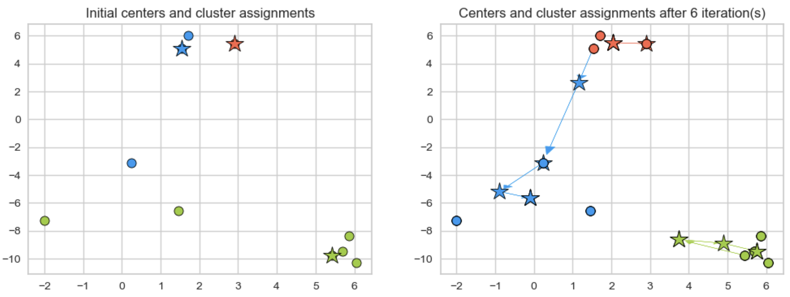

## Supervised Learning
\

In the next section, we will briefly introduce a few types of machine learning models that are often used for supervised learning tasks.

We will discuss some basic intuition around how they work, and also discuss their relative strengths and shortcomings.

# Tree-based models

## Tree-based models


We have seen that decision trees are prone to overfitting. There are several models that extend the basic idea of using decision trees.

## Random Forest


Train an ensemble of distinct decision trees.

## Random Forest
\

Each tree trains on a random sample of the data. Some times the features used to split are also randomized at each node.

Idea: Individual trees still learn noise in the data, but the noise should "average out" over the ensemble.

## Gradient Boosted Trees


Each tree tries to "correct" or improve the previous tree's prediction.

## Tree-Based Models
\ 

Random Forest, XGBoost, etc are all easily available as "out-of-the box solutions".

Pros: 

* Perform well on a variety of tasks
* Random forest in particular are easy to train and robust to outliers.

Cons:

* Not always interpretable
* Not good at handling sparse data
* Can also still overfit.


# Linear models

## Linear models
\


Many of you might be familiar with least-squares regression. We find the line of best fit by minimizing the 'squared error' of the predictions.


## Linear Models
\ 


Squared Error is very sensitive to outliers. Far-away points contribute a very large squared error, and even relatively few points can affect the outcome.

## Linear Models
\ 


We can use other notions of "best fit". Using absolute error makes the model more resistant to outliers!

## Linear Classifiers
\

We can also build linear models for classification tasks. The idea is to convert the output from an arbitrary number to a number between 0 and 1, and treat it like a "probability".

In *logistic regression*, we squash the output using the sigmoid function and then adjust parameters (in training) to find the choice that makes the data "most likely".

## Linear Classifiers



Can you guess what this dataset is?

## Linear Classifiers



Logistic Regression predicts a *linear* decision boundary.

<!--

## Sentiment Analysis: An Example

```{python}
import sys, os
sys.path.append(os.path.join(os.path.abspath("."), "code"))
from sup_learning import *
from sklearn.datasets import make_blobs
from mglearn import discrete_scatter
```
\
Let us attempt to use logistic regression to do sentiment analysis on a database of IMDB reviews. The database is available [here](https://www.kaggle.com/datasets/lakshmi25npathi/imdb-dataset-of-50k-movie-reviews?resource=download).

```{python}
#| echo: True
imdb_df = pd.read_csv("data/imdb_master.csv", encoding="ISO-8859-1")
imdb_df.rename(columns={"sentiment": "label"}, inplace = True)
```
```{python}
imdb_df = imdb_df[imdb_df["label"].str.startswith(("pos", "neg"))]
imdb_df.head()
```

We will use only about 10% of the dataset for training (to speed things up)

```{python}
imdb_df["review_pp"] = imdb_df["review"].apply(replace_tags)
train_df, test_df = train_test_split(imdb_df, test_size=0.9, random_state=123)
X_train, y_train = train_df["review_pp"], train_df["label"]
X_test, y_test = test_df["review_pp"], test_df["label"]
```

## Bag of Words
\
To create features that logistic regression can use, we will represent these reviews via a "bag of words" strategy.

We create a new feature for every word that appears in the dataset. Then, if a review contains that word exactly once, the corresponding feature gets a value of 1 for that review. If the word appears four times, the feature gets a value of 4. If the word is not present, it's marked as 0.

## Bag of Words
\
Notice that the result is a sparse matrix. Most reviews contain only a small number of words.

```{python}
#| echo: True
vec = CountVectorizer(stop_words="english")
bow = vec.fit_transform(X_train)
bow
```

There are a total of 38867 "words" among the reviews. Here are some of them: 

```{python}
vocab = vec.get_feature_names_out()
vocab[::1000]
```

## Checking the class counts

Let us see how many reviews are positive, and how many are negative.
\ 

```{python}
#| echo: True
y_train.value_counts()
```
\

The dataset looks pretty balanced, so a classifier predicting at random would at best guess about 50% correctly.

We will not train our model.

# Testing Performance

## Testing Performance
\

Let's see how the model performs after training.

```{python}
pipe_lr = make_pipeline(
    CountVectorizer(stop_words="english"),
    LogisticRegression(max_iter=1000),
)
scores = cross_validate(pipe_lr, X_train, y_train, return_train_score=True)
pd.DataFrame(scores)
```
\
We're able to predict with roughly 84% accuracy on validation sets. Looks like our model learned something!

<!--

## Tuning hyperparameters
\

However, the training scores are perfect (and higher than validation scores) so our model is likely overfitting.

Maybe it just memorized some rare words, each appearing only in one review, and associated these with the review's label. We could try reducing the size of our dictionary to prevent this.

## Tuning hyperparameters
\

There are many tools available to automate the search for good hyperparameters. These can make our life easy, but there is always the danger of optimization bias in the results.


```{python}

from scipy.stats import loguniform, randint, uniform
from sklearn.model_selection import RandomizedSearchCV

param_dist = {
    "countvectorizer__max_features": randint(10, len(vocab)),
    "logisticregression__C": loguniform(1e-3, 1e3)
}
pipe_lr = make_pipeline(CountVectorizer(stop_words="english"), LogisticRegression(max_iter=1000))
random_search = RandomizedSearchCV(pipe_lr, param_dist, n_iter=10, n_jobs=-1, return_train_score=True)
random_search.fit(X_train, y_train)

best_model = random_search.best_estimator_

```


## Investigating the model
::: {.scroll-container style="overflow-y: scroll; height: 400px;"}
\

Let's see what associations our model learned.

```{python}
#| code-overflow: scroll

# Get feature names
feature_names = best_model.named_steps['countvectorizer'].get_feature_names_out().tolist()

# Get coefficients 
coeffs = best_model.named_steps["logisticregression"].coef_.flatten()

word_coeff_df = pd.DataFrame(coeffs, index=feature_names, columns=["Coefficient"])
word_coeff_df.sort_values(by="Coefficient", ascending=False)
```
:::


## Investigating the model
\

They make sense! Let's visualize the 20 most important features.

```{python}
mglearn.tools.visualize_coefficients(coeffs, feature_names, n_top_features=20)
```

## Making Predictions
\

Finally, let's try predicting on some new examples.
\

```{python}
fake_reviews = ["It got a bit boring at times but the direction was excellent and the acting was flawless. Overall I enjoyed the movie and I highly recommend it!",
 "The plot was shallower than a kiddie pool in a drought, but hey, at least we now know emojis should stick to texting and avoid the big screen."
]
fake_reviews
```

Here are the model predictions:

```{python}
best_model.predict(fake_reviews)
```

\

Let's see which vocabulary words were present in the first review, and how they contributed to the classification.

## Understanding Predictions
::: {.scroll-container style="overflow-y: scroll; height: 400px;"}
```{python}
plot_coeff_example(best_model, fake_reviews[0], coeffs, feature_names)
```
:::


## Summary
\

The bag-of-words representation was very simple-- we only counted which words appeared in which reviews. There was no attempt to maintain syntactical or grammatical structure or to study correlations between words.

Modern language models often make use of richer representations that can better capture "meaning" in words and sentences. We will discuss these "embeddings" later on in the workshop!

-->

## Linear Models
\

Pros:

* Easy to train and to interpret
* Widely applicable despite some strong assumptions
* If you have a regression task, check whether a linear regression is already good enough! If you have a classification task, logistic regression is a go-to first option.

Cons:

* Strong assumptions
* Linear decision boundaries for classifiers
* Correlated features can cause problems

# Analogy and similarity in Machine Learning

## Analogy-based models


Returning to our older dataset.

## Analogy-based models


How would you classify the green dot?

## Analogy-based models
\

Idea: predict on new data based on "similar" examples in the training data.

## *K*-Nearest-Neighbour Classifier
\

Find the *K* nearest neighbours of an example, and predict whichever class was most common among them.

'*K*' is a hyperparameter. Choosing *K=1* is likely to overfit. If the dataset has *N* examples, setting *K=N* just predicts the mode (dummy classifier).

No training phase, but the model can get arbitrarily large (and take very long to make predictions).

## Cosine Similarity

Another popular choice for measuring similarity is "cosine distance". Useful when orientation matters more than absolute size.

Popular choice in word embeddings when working with text data.

## The RBF Kernel
\

The RBF kernel "transforms" our data into a representation that directly captures similarity between examples. We get a new column (i.e. new feature) for every data point. The value of the new features is determined by computing pairwise distances between points, and then applying a Gaussian.

Feature values are close to zero for far-away points, and close to 1 for nearby points.

## Linear models with RBF kernel
\ 

We can train a linear model on the new features!

The model stores examples with positive and negative weights. Being close to a positive example makes your label more likely to be positive.

Can lead to "smoother" decision boundaries than K-NNs, and potentially to a smaller trained model.

## KNNs and SVMs
\ 


## Analogy-based Models
\

Pros:

* Do not need to make assumptions about the underlying data
* Given enough data, should pretty much always work.

Cons:

* *Enough* data can mean ... a lot
* Computing distances is time-consuming for large datasets
* Can't really interpret the model's decisions.

# Clustering

## K-means clustering

```{python}
X, y = make_blobs(n_samples=10, centers=3, n_features=2, random_state=10)
fig, axes = plt.subplots(1, 2, figsize=(12, 4))
discrete_scatter(X[:, 0], X[:, 1], ax = axes[0]); # user-defined plotting function defined in code/plotting_functions.py
discrete_scatter(X[:, 0], X[:, 1], y=y, markers='o', ax = axes[1]);
```

## K-means clustering
\ 
- **Algorithm Steps**:
  1. Select K initial centroids.
  2. Assign each data point to the nearest centroid.
  3. Recalculate centroids based on assigned points.
  4. Repeat until centroids stabilize or reach a maximum number of iterations.

## K-means clustering



## K-Means pros and cons
- **Advantages**:
  - Simple and efficient for large datasets.
  - Works well with spherical clusters.

- **Limitations**:
  - Needs pre-defined K.
  - Sensitive to outliers and initial centroid placement.
  - Poor performance for irregular clusters, or clusters of varying sizes and densities

## Other Clustering Algorithms

Some other clustering options that offer more flexibility than K-means:

- Gaussian Mixture Models
- Density-based Clustering (DBSCAN)
- Heirarchical Clustering

Remember, data representation matters! 

## A Look Ahead
\

We saw an example of a linear model that was able to learn a *non-linear* decision boundary. The key was finding a non-linear feature transformation that was appropriate for the problem.

Even if our data is not linearly separable, there could be a good choice of feature transform out there that *makes* it linearly separable.

##

Wouldn't it be nice if we could train a machine learning model to find such a transform?
