## 🎯 Learning Outcomes

By the end of this module, you will be able to:

- **Explain** the basics of neural networks and how they build upon linear models.
- **Describe** the role of neural networks in machine learning, including their strengths and limitations.
- **Outline** the key steps involved in training a neural network.
- **Identify** commonly used neural network architectures (CNNs, RNNs, Transformers) and their typical applications.

---


## Remember this picture we saw earlier? 

- **Deep Learning (DL)** is a subset of machine learning 

{.nostretch fig-align="center" width="700px"}

## Image classification
\

Have you used search in Google Photos? You can search for "my photos of cat" and it will retrieve photos from your libraries containing cats.
This can be done using **image classification**, which is treated as a supervised learning problem, where we define a set of target classes (objects to identify in images), and train a model to recognize them using labeled example photos.

## Image classification
\

Image classification is not an easy problem because of the variations in the location of the object, lighting, background, camera angle, camera focus etc.


<!-- [Source](https://developers.google.com/machine-learning/practica/image-classification) -->

## Neural networks {.smaller}
\

- Neural networks are perfect for these types of problems where local structures are important. 
- A significant advancement in image classification was the application of **convolutional neural networks** (ConvNets or CNNs) to this problem. 
  - [ImageNet Classification with Deep Convolutional
Neural Networks](https://dl.acm.org/doi/10.1145/3065386)
  - Achieved a winning test error rate of 15.3%, compared to 26.2% achieved by the second-best entry in the ILSVRC-2012 competition. 
- Let's go over the basics of a neural network.

## A graphical view of a linear model {.smaller}
:::: {.columns}

:::{.column width="50%"}
```{python}
import mglearn

mglearn.plots.plot_logistic_regression_graph()
```
:::

:::{.column width="50%"}
- Remember this graphical view of linear models? 
- We have 4 features: x[0], x[1], x[2], x[3]
- The output is calculated as $y = x[0]w[0] + x[1]w[1] + x[2]w[2] + x[3]w[3]$
- For simplicity, we are ignoring the bias term. 
:::
::::


## Introduction to neural networks
\

- Neural networks can be viewed a generalization of linear models where we apply a series of transformations.
- Below we are adding one "layer" of transformations in between features and the target. 
- We are repeating the the process of computing the weighted sum multiple times.  
- The **hidden units** (e.g., h[1], h[2], ...) represent the intermediate processing steps. 

```{python}
mglearn.plots.plot_single_hidden_layer_graph()
```

## One more layer of transformations 
\

- Now we are adding one more layer of transformations. 

```{python}
mglearn.plots.plot_two_hidden_layer_graph()
```

## Neural networks 
\

- With a neural net, you specify the number of features after each transformation.
  - In the above, it goes from 4 to 3 to 3 to 1.

- To make them really powerful compared to the linear models, we apply a non-linear function to the weighted sum for each hidden node. 
- Neural network = neural net
- Deep learning ~ using neural networks

## Neural networks example and terminology

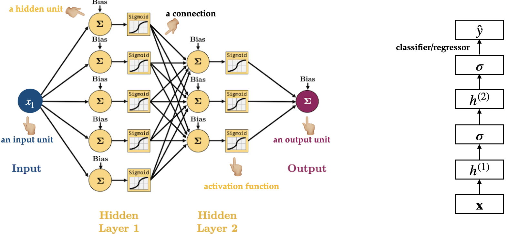

## How does training work in neural networks? (High-Level) {.smaller}

Training a neural network has **two main steps:**

- **Forward pass:**  
  Feed the input through the network to calculate the predicted output using the current parameter values (weights).

- **Backward pass:**  
  - Measure how far the predicted output is from the actual target (this is the **loss**).
  - Calculate how to adjust each parameter to improve future predictions (**gradients**).
  - Update the parameters using these gradients — this helps the model improve.

- Summary
  - **Input $\rightarrow$ Forward Pass $\rightarrow$ Loss $\rightarrow$ Backward Pass $\rightarrow$ Parameter Update $\rightarrow$ Repeat**
  - The model repeats this process many times, gradually improving its predictions.
---

## Forward pass: Calculate the output

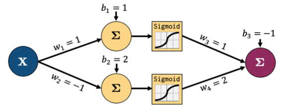

In the **forward pass**: 

- Multiply the inputs by the weights
- Pass through activation functions (non-linearities)
- Calculate the predicted output

---

## Forward pass: Continue through the layers

- The calculations continue through each layer of the network.

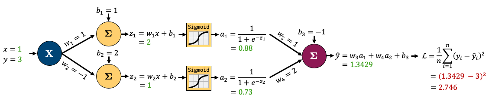

---

## Backward pass: Adjust the parameters (high-level)

- **Step 1:** Compare the predicted output to the actual target using a **loss function** (how wrong was the prediction?).

- **Step 2:** Calculate how much each parameter contributed to the error (this is the **gradient** — it tells us which direction to adjust).

- **Step 3:** Update the parameters slightly in the direction that **reduces the loss** (this is called gradient descent).


## Backward pass 

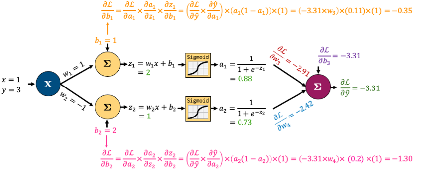

👉 **Good news:** We don’t have to compute these gradients by hand — modern ML libraries like PyTorch and TensorFlow handle this for us automatically using **backpropagation**.

## Why neural networks? {.smaller}

- They can learn very complex functions.
  - The fundamental tradeoff is primarily controlled by the **number of layers** and **layer sizes**.
  - More layers / bigger layers --> more complex model.
  - You can generally get a model that will not underfit. 

- They work really well for structured data:
  - 1D sequence, e.g. timeseries, language
  - 2D image
  - 3D image or video
- They've had some incredible successes in the last 12 years.
- Transfer learning (coming later today) is really useful.  

## Why not neural networks? {.smaller}

- Often they require a lot of data.
- They require a lot of compute time, and, to be faster, specialized hardware called [GPUs](https://en.wikipedia.org/wiki/Graphics_processing_unit).
- They have huge numbers of hyperparameters
  - Think of each layer having hyperparameters, plus some overall hyperparameters.
  - Being slow compounds this problem.
- They are not interpretable.
- I don't recommend training them on your own without further training
- Good news
    - You don't have to train your models from scratch in order to use them.
    - I'll show you some ways to use neural networks without training them yourselves. 

## Deep learning software

The current big players are:

1. [PyTorch](http://pytorch.org)
2. [TensorFlow](https://www.tensorflow.org)

Both are heavily used in industry. If interested, see [comparison of deep learning software](https://en.wikipedia.org/wiki/Comparison_of_deep_learning_software).

<br><br>

## Commonly Used Neural Network Architectures

Neural networks come in different shapes depending on the type of data and the task.

---

## Convolutional Neural Networks (CNNs) {.smaller}

- Commonly used in **image classification, object detection, and medical imaging.**
- What's the problem if we use the above feedforward architecture to learn patterns from images? 

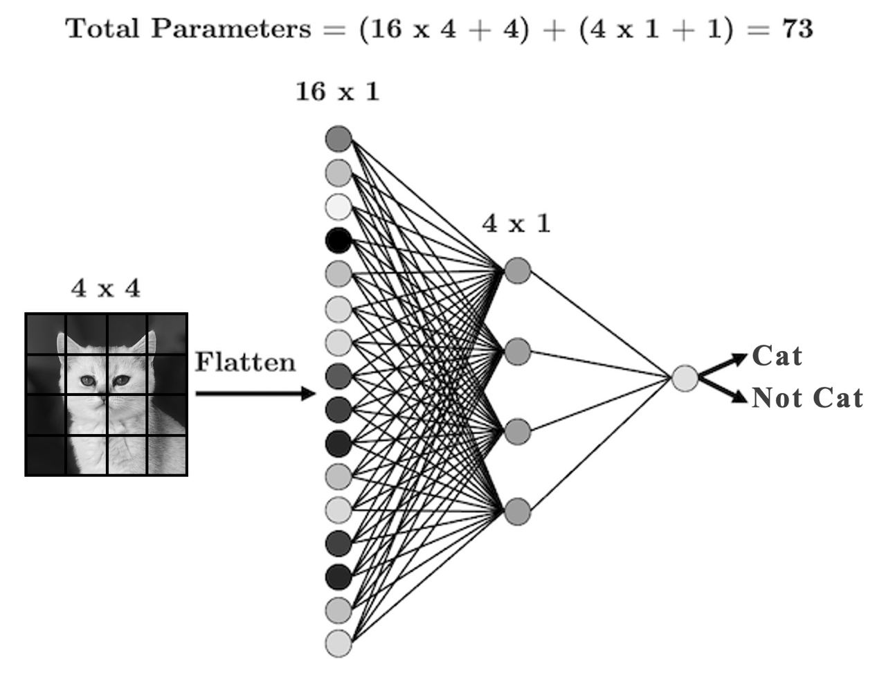

## Filters 

- Uses filters that "slide" over the input to detect local patterns.

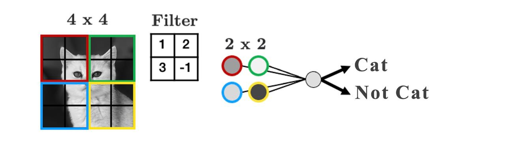

- Play around with filters: https://setosa.io/ev/image-kernels/

## CNNs 

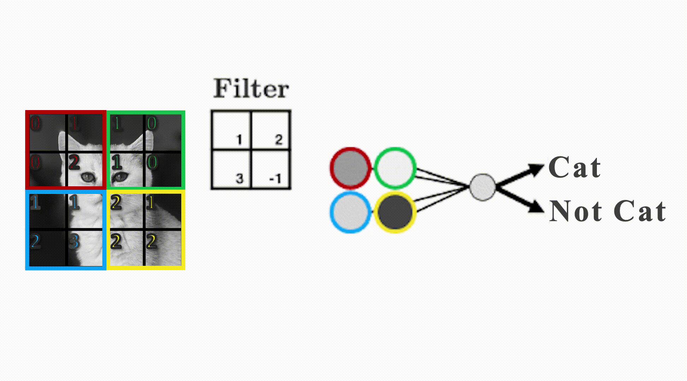

## CNNs big picture

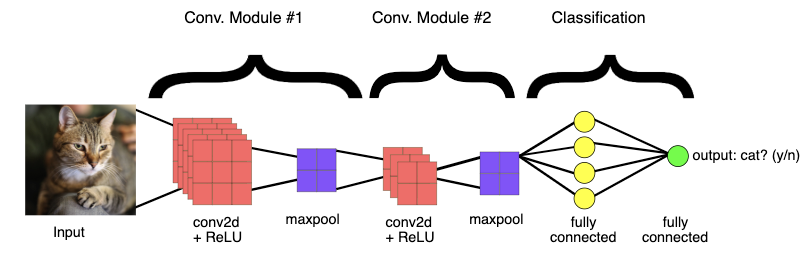

---

## Combining CNN and NN {.smaller}

- Sometimes you'll want to combine different types of data in a single network
- The most common case is combining tabular data with image data, for example, using both real estate data and images of a house to predict its sale price:

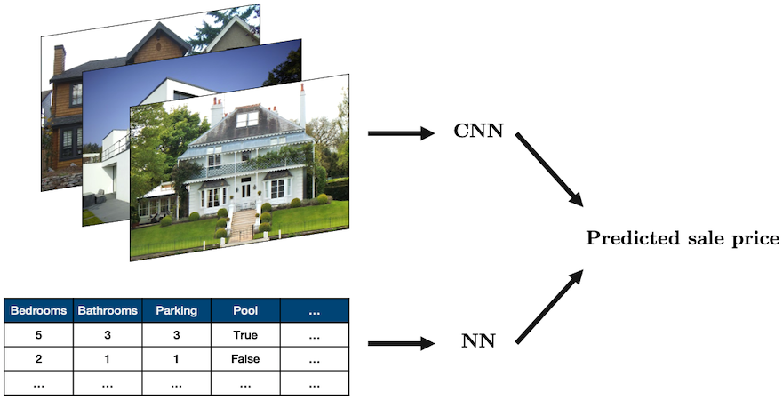

Source: "[House](https://www.flickr.com/photos/68089229@N06/17458373552)" by [oatsy40](https://www.flickr.com/photos/68089229@N06), "[House in Vancouver](https://www.flickr.com/photos/17573364@N00/433449690)" by [pnwra](https://www.flickr.com/photos/17573364@N00), "[House](https://www.flickr.com/photos/21098413@N04/5405425139)" by [noona11](https://www.flickr.com/photos/21098413@N04) all licensed under [CC BY 2.0](https://creativecommons.org/licenses/by/2.0/?ref=ccsearch&atype=rich).

## Recurrent Neural Networks (RNNs) {.smaller}

- Designed for **sequential data** like time series, text, or biological sequences.
- Passes hidden states through time steps to "remember" past information.

👉 Commonly used in **language modeling, speech recognition, and system control.**

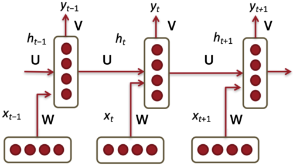

---

## RNN activity {.smaller}

RNN is like your brain reading a sentence word by word. 

- **Input at each time step**: The current word you read
- **Hidden state**: Your current mental understanding
- **Output**: Your interpretation, reaction, or prediction at that point in time 

Two rows of students:

- Front row = input layer (observations at each time step)
- Back row = hidden state at each time step
- Each column is a time step (0 through 4)
- So we'll have 4 front-row students: $x_0$ to $x_3$
- And 4 back-row students: $h_0$ to $h_3$

## RNN activity {.smaller}
1. At time step 0:
    - Front-row student $x_0$ gets a word
    - They pass it to the back-row student behind them ($h_0$).
2.	At time step 1 (and beyond):
    - The front-row student (e.g., $x_1$) gets a new word 
    - The back-row student (e.g., $h_1$) receives:
        - The current input from the front-row student (e.g., $x_1$)
        - Whatever "memory" is passed from the previous hidden state (e.g., $h_0$)
        - $h_1$ combines this (e.g., by writing a summary phrase or combining keywords).
3.	Repeat until time step 3 or 4.
4.	Final time step: $h_3$ summarizes what they remember (e.g., predicts next word, gives the "mood" of the sentence, etc.)


## RNN architectures

- A number of architectures are possible with RNNs, which makes them a very rich family of models.  

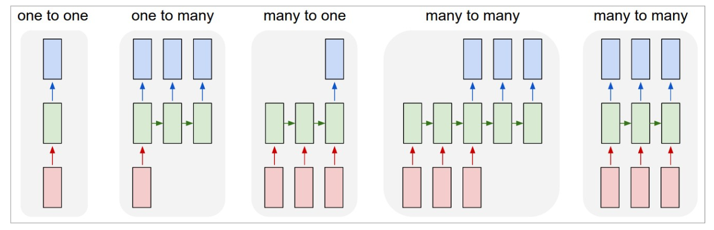

## Transformer architectures

- What kind of neural network models are behind **state-of-the-art Generative AI** systems like ChatGPT, Gemini, Bard, DALL-E, GitHub Copilot, and Meta’s Llama?

- The answer: **Transformer architectures.**


---

## What makes transformer architectures special?

- Transformers were **designed for sequences** but avoid the limitations of earlier sequence models like RNNs.
- They use **attention mechanisms** to model relationships between all parts of the sequence at once.
- They scale well to very large datasets and can handle long-term dependencies effectively.

👉 Transformers power **large language models (LLMs), image captioning models, and multimodal models like CLIP.**

---

## Transformer architecture: Key ideas

:::: {.columns}

:::{.column width="50%"}
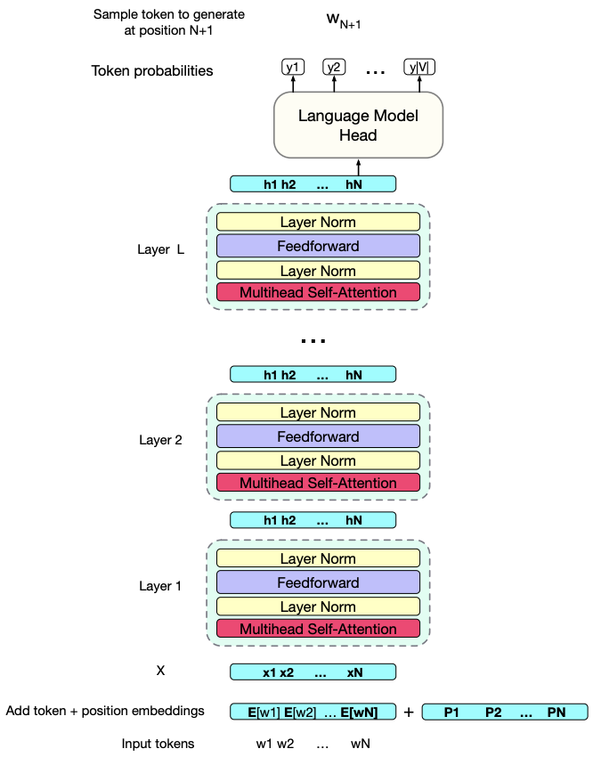
:::

:::{.column width="50%"}

- **Input:** A sequence of tokens (words, image patches, etc.)
- **Output:** A sequence of rich, context-aware representations for each token.
- Each layer iteratively refines the token representations.
- These layers learn **how each token relates to the others, regardless of their position in the sequence.**

:::
::::

---

## Transformer summary

- Designed to handle **long sequences efficiently.**
- Learn **contextual meaning** by comparing all tokens to each other (via attention).
- Now the backbone of **almost all modern Generative AI models.**
- Examples: BERT, GPT-3, GPT-4, Gemini, DALL-E, GitHub Copilot, Meta’s Llama.

---

## Summary 
\

- Neural networks are a flexible class of models.
  - They are particular powerful for structured input like images, videos, audio, text etc.
  - They can be challenging to train and often require significant computational resources.
- The good news is we can use pre-trained neural networks.
  - This saves us a huge amount of time/cost/effort/resources.
  - We can use these pre-trained networks directly or use them as feature transformers. 
