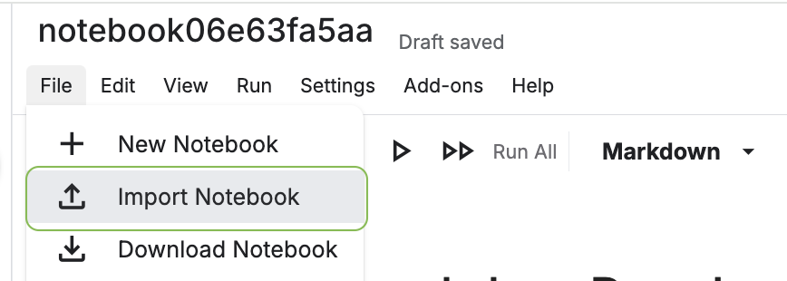
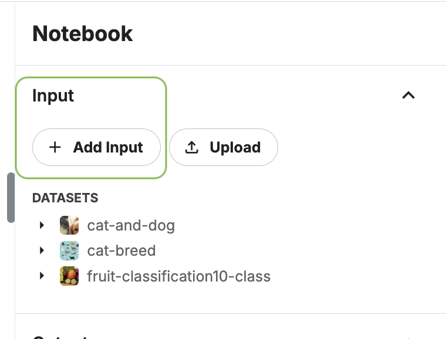

## Your turn

Here is a Jupyter notebook you can download for further exploration:

[Download and Save the Jupyter Notebook](https://github.com/kvarada/FoS-Intro-to-ML-2025/blob/main/website/slides/downloads/exercise-01-ml-fundamentals.ipynb)

## How To Work On Kaggle

1. Go to [https://www.kaggle.com/kernels](https://www.kaggle.com/kernels)
2. Make an account if you don't have one, and verify your phone number (to get access to GPUs-- this is not needed for the current exercise, but will be useful for the deep learning exercise later today).
3. Select `+ New Notebook`

4. Go to `File -> Import Notebook`

5. Upload the downloaded notebook

## How To Add a Dataset

1. Click `+ Add data` at the top right of the notebook.

2. Choose `Datasets` and search for the keyword (e.g. 'Spotify Song Attributes'). Several datasets will appear. Look for and 'Add' the dataset.

