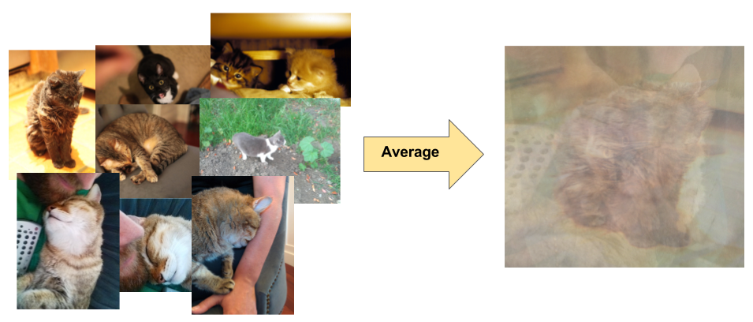

```{python}
import mglearn
import json
import numpy as np
import pandas as pd
import sys, os
sys.path.append(os.path.join(os.path.abspath("."), "code"))
from deep_learning_code import *
import matplotlib.pyplot as plt
from sklearn.linear_model import LogisticRegression
from torchvision import datasets, models, transforms, utils
from sklearn.pipeline import Pipeline, make_pipeline
from sklearn.preprocessing import StandardScaler
import matplotlib.image as mpimg
%matplotlib inline
```

## Learning outcomes 
\
From this module, you will be able to 

- Explain the role of neural networks in machine learning, including their advantages and disadvantages.
- Discuss why traditional methods are less effective for image data.
- Gain a high-level understanding of transfer learning.
- Use transfer learning for your own tasks. 
- Differentiate between image classification and object detection.


## Image classification
\

Have you used search in Google Photos? You can search for "my photos of cat" and it will retrieve photos from your libraries containing cats.
This can be done using **image classification**, which is treated as a supervised learning problem, where we define a set of target classes (objects to identify in images), and train a model to recognize them using labeled example photos.

## Image classification
\

Image classification is not an easy problem because of the variations in the location of the object, lighting, background, camera angle, camera focus etc.


<!-- [Source](https://developers.google.com/machine-learning/practica/image-classification) -->

## Neural networks
\

- Neural networks are perfect for these types of problems where local structures are important. 
- A significant advancement in image classification was the application of **convolutional neural networks** (ConvNets or CNNs) to this problem. 
  - [ImageNet Classification with Deep Convolutional
Neural Networks](https://dl.acm.org/doi/10.1145/3065386)
  - Achieved a winning test error rate of 15.3%, compared to 26.2% achieved by the second-best entry in the ILSVRC-2012 competition. 
- Let's go over the basics of a neural network.

## A graphical view of a linear model {.smaller}
:::: {.columns}

:::{.column width="50%"}
```{python}
import mglearn

mglearn.plots.plot_logistic_regression_graph()
```
:::

:::{.column width="50%"}
- Remember this graphical view of linear models? 
- We have 4 features: x[0], x[1], x[2], x[3]
- The output is calculated as $y = x[0]w[0] + x[1]w[1] + x[2]w[2] + x[3]w[3]$
- For simplicity, we are ignoring the bias term. 
:::
::::


## Introduction to neural networks
\

- Neural networks can be viewed a generalization of linear models where we apply a series of transformations.
- Below we are adding one "layer" of transformations in between features and the target. 
- We are repeating the the process of computing the weighted sum multiple times.  
- The **hidden units** (e.g., h[1], h[2], ...) represent the intermediate processing steps. 

```{python}
mglearn.plots.plot_single_hidden_layer_graph()
```

## One more layer of transformations 
\

- Now we are adding one more layer of transformations. 

```{python}
mglearn.plots.plot_two_hidden_layer_graph()
```

## Neural networks 
\

- With a neural net, you specify the number of features after each transformation.
  - In the above, it goes from 4 to 3 to 3 to 1.

- To make them really powerful compared to the linear models, we apply a non-linear function to the weighted sum for each hidden node. 
- Neural network = neural net
- Deep learning ~ using neural networks

## Why neural networks? {.smaller}

- They can learn very complex functions.
  - The fundamental tradeoff is primarily controlled by the **number of layers** and **layer sizes**.
  - More layers / bigger layers --> more complex model.
  - You can generally get a model that will not underfit. 

- They work really well for structured data:
  - 1D sequence, e.g. timeseries, language
  - 2D image
  - 3D image or video
- They've had some incredible successes in the last 12 years.
- Transfer learning (coming later today) is really useful.  

## Why not neural networks? {.smaller}

- Often they require a lot of data.
- They require a lot of compute time, and, to be faster, specialized hardware called [GPUs](https://en.wikipedia.org/wiki/Graphics_processing_unit).
- They have huge numbers of hyperparameters
  - Think of each layer having hyperparameters, plus some overall hyperparameters.
  - Being slow compounds this problem.
- They are not interpretable.
- I don't recommend training them on your own without further training
- Good news
    - You don't have to train your models from scratch in order to use them.
    - I'll show you some ways to use neural networks without training them yourselves. 

## Deep learning software

The current big players are:

1. [PyTorch](http://pytorch.org)
2. [TensorFlow](https://www.tensorflow.org)

Both are heavily used in industry. If interested, see [comparison of deep learning software](https://en.wikipedia.org/wiki/Comparison_of_deep_learning_software).

<br><br>

## Convolutional Neural Networks (CNNs)

## Recurrent Neural Networks (RNNs)

## Transformer Architectures 

## Summary 
\

- Neural networks are a flexible class of models.
  - They are particular powerful for structured input like images, videos, audio, text etc.
  - They can be challenging to train and often require significant computational resources.
- The good news is we can use pre-trained neural networks.
  - This saves us a huge amount of time/cost/effort/resources.
  - We can use these pre-trained networks directly or use them as feature transformers. 
