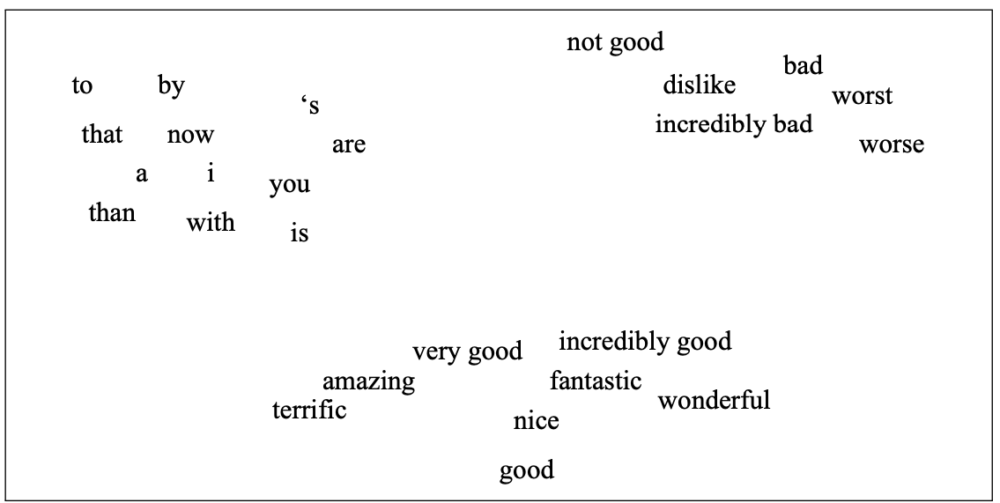
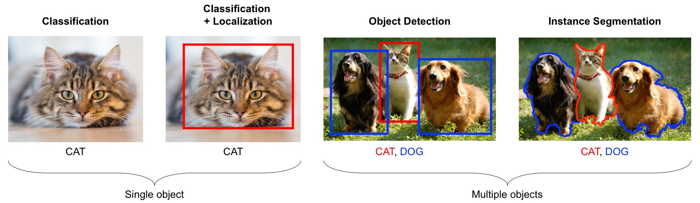
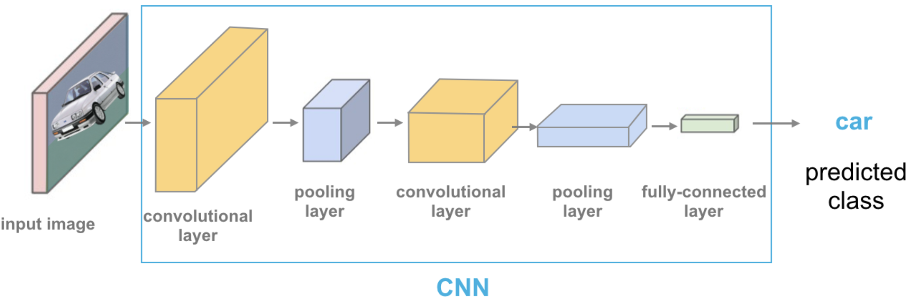
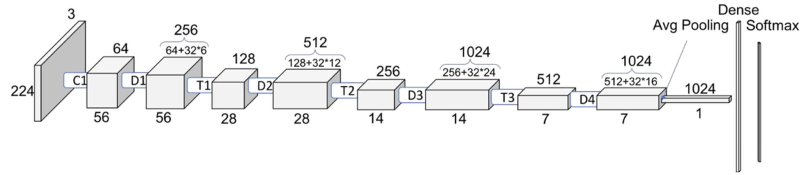
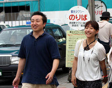

```{python}
import mglearn
import json
import numpy as np
import pandas as pd
import sys, os
sys.path.append(os.path.join(os.path.abspath("."), "code"))
from unsupervised_learning_code import *
from deep_learning_code import *
from plotting_functions import *
import matplotlib.pyplot as plt
from sklearn.linear_model import LogisticRegression
from torchvision import datasets, models, transforms, utils
from sklearn.pipeline import Pipeline, make_pipeline
from sklearn.preprocessing import StandardScaler
import matplotlib.image as mpimg
%matplotlib inline
```

## 🎯 Learning objectives
\

By the end of this session, participants should be able to:

- Understand what embeddings are and why they're useful
- Gain a high-level understanding of transfer learning.
- Distinguish between training a model from scratch vs. using a pre-trained one
- Use transfer learning for your own tasks. 
- Generate and visualize embeddings from images and text
- Use pre-trained models (e.g., MiniLM, DenseNet, CLIP)
- Identify ML tasks in your own domain that could benefit from embeddings


## Why Pretrained Models?

- Training from scratch = lots of data + compute
- Pretrained models already **know a lot** from massive datasets
- You can:
  - Extract features (embeddings)
  - Fine-tune on your domain-specific task

## What are embeddings?

- Embeddings are **numerical vector representations** of complex objects
- They enable us to calculate distances between concepts 
  - Similar inputs $\rightarrow$ nearby vectors



## Embeddings are commonly used for 

  - Similarity search
  - Clustering
  - Visualization
  - Downstream ML models

## Popular embeddings  

**Image**

- **DenseNet**, **ResNet**, **ViT**
- Input: microscopy images, wildlife, rock photos

**Text**

- **Word embeddings**
- **MiniLM**, **Sentence-BERT**
- Input: research descriptions, abstracts, feedback


# Image embeddings 

## Introduction to computer vision
\

- [Computer vision](https://en.wikipedia.org/wiki/Computer_vision) refers to understanding images/videos, usually using ML/AI. 
- In the last decade this field has been dominated by deep learning. We will explore **image classification** and **object detection**.

## Introduction to computer vision
\

- image classification: is this a cat or a dog?
- object localization: where is the cat in this image?
- object detection: What are the various objects in the image? 
- instance segmentation: What are the shapes of these various objects in the image? 
- and much more...


<!-- Source: https://learning.oreilly.com/library/view/python-advanced-guide/9781789957211/--> 


## Pre-trained models
\

- In practice, very few people train an entire CNN from scratch because it requires a large dataset, powerful computers, and a huge amount of human effort to train the model.
- Instead, a common practice is to download a pre-trained model and fine tune it for your task. This is called **transfer learning**.
- Transfer learning is one of the most common techniques used in the context of computer vision and natural language processing.
- It refers to using a model already trained on one task as a starting point for learning to perform another task.

## Pre-trained models out-of-the-box 
\



<!-- Source: https://cezannec.github.io/Convolutional_Neural_Networks/ -->

- Let's first apply one of these pre-trained models to our own problem right out of the box. 


## Pre-trained models out-of-the-box 
\

- We can easily download famous models using the `torchvision.models` module. All models are available with pre-trained weights (based on ImageNet's 224 x 224 images)
- We used a pre-trained model vgg16 which is trained on the ImageNet data. 
- We preprocess the given image. 
- We get prediction from this pre-trained model on a given image along with prediction probabilities.  
- For a given image, this model will spit out one of the 1000 classes from ImageNet. 

## Pre-trained models out-of-the-box {.scrollable}

- Let's predict labels with associated probabilities for unseen images

::: {.scroll-container style="overflow-y: scroll; height: 400px;"}
```{python}
import glob
import matplotlib.pyplot as plt
images = glob.glob("data/test_images/*.*")
plt.figure(figsize=(5, 5));
for image in images:
    img = Image.open(image)
    img.load()
    
    plt.imshow(img)
    plt.show()
    df = classify_image(img)
    print(df.to_string(index=False))
    print("--------------------------------------------------------------")
```
:::


## Pre-trained models out-of-the-box 
\

- We got these predictions without "doing the ML ourselves".
- We are using **pre-trained** `vgg16` model which is available in `torchvision`.
  - `torchvision` has many such pre-trained models available that have been very successful across a wide range of tasks: AlexNet, VGG, ResNet, Inception, MobileNet, etc.
- Many of these models have been pre-trained on famous datasets like **ImageNet**. 
- So if we use them out-of-the-box, they will give us one of the ImageNet classes as classification. 

## Pre-trained models out-of-the-box {.smaller}
\

- Let's try some images which are unlikely to be there in ImageNet. 
- It's not doing very well here because ImageNet doesn't have proper classes for these images.

::: {.scroll-container style="overflow-y: scroll; height: 400px;"}
```{python}
# Predict labels with associated probabilities for unseen images
images = glob.glob("data/random_img/*.*")
for image in images:
    img = Image.open(image)
    img.load()
    plt.imshow(img)
    plt.show()
    df = classify_image(img)    
    print(df.to_string(index=False))
    print("--------------------------------------------------------------")
```
:::

## Pre-trained models out-of-the-box
\

- Here we are using pre-trained models out-of-the-box. 
- Can we use pre-trained models for our own classification problem with our classes? 
- Yes!! We have two options here:
    1. Add some extra layers to the pre-trained network to suit our particular task
    2. Pass training data through the network and save the output to use as features for training some other model


## Pre-trained models to extract features 
\

- Let's use pre-trained models to extract features.
- We will pass our specific data through a pre-trained network to get a feature vector for each example in the data. 
- The feature vector is usually extracted from the last layer, before the classification layer from the pre-trained network. 
- You can think of each layer a transformer applying some transformations on the input received to that later. 


## Pre-trained models to extract features 
\

- Once we extract these feature vectors for all images in our training data, we can train a machine learning classifier such as logistic regression or random forest. 
- This classifier will be trained on our classes using feature representations extracted from the pre-trained models.  
- Let's try this out. 
- It's better to train such models with GPU. Since our dataset is quite small, we won't have problems running it on a CPU. 

## Pre-trained models to extract features 
\

Let's look at some sample images in the dataset. 

::: {.scroll-container style="overflow-y: scroll; height: 400px;"}
```{python}
    data_dir = 'data/food/'
    image_datasets, dataloaders = read_data(data_dir)
    dataset_sizes = {x: len(image_datasets[x]) for x in ["train", "valid"]}
    class_names = image_datasets["train"].classes
    inputs, classes = next(iter(dataloaders["valid"]))
    plt.figure(figsize=(10, 8)); plt.axis("off"); plt.title("Sample valid Images")
    plt.imshow(np.transpose(utils.make_grid(inputs, padding=1, normalize=True),(1, 2, 0)));
```
:::

## Dataset statistics
\

Here is the stat of our toy dataset. 

```{python}
    print(f"Classes: {image_datasets['train'].classes}")
    print(f"Class count: {image_datasets['train'].targets.count(0)}, {image_datasets['train'].targets.count(1)}, {image_datasets['train'].targets.count(2)}")
    print(f"Samples:", len(image_datasets["train"]))
    print(f"First sample: {image_datasets['train'].samples[0]}")
```


## Extract features (embeddings)
\

- Now for each image in our dataset, we'll extract a feature vector from a pre-trained model called densenet121, which is trained on the ImageNet dataset.  

```{python}
densenet = models.densenet121(weights="DenseNet121_Weights.IMAGENET1K_V1")
densenet.classifier = nn.Identity()  # remove that last "classification" layer
Z_train, y_train, Z_valid, y_valid = get_features(
    densenet, dataloaders["train"], dataloaders["valid"]
)
```

## Shape of the embeddings
\

- Now we have extracted feature vectors for all examples. What's the shape of these features or embeddings?

```{python}
Z_train.shape
```

- The size of each feature vector is 1024 because the size of the last layer in densenet architecture is 1024.  



[Source](https://towardsdatascience.com/understanding-and-visualizing-densenets-7f688092391a)

## Embeddings given by densenet 
\ 

- Let's examine the feature vectors. 

```{python}
pd.DataFrame(Z_train).head()
```
- The features are hard to interpret but they have some important information about the images which can be useful for classification.  

## Logistic regression with the extracted features 
\

- Let's try out logistic regression on these extracted features. 

```{python}
pipe = make_pipeline(StandardScaler(), LogisticRegression(max_iter=2000))
pipe.fit(Z_train, y_train)
print("Training score: ", pipe.score(Z_train, y_train))
```

```{python}
pipe.score(Z_valid, y_valid)
print("Validation score: ", pipe.score(Z_valid, y_valid))
```

- This is great accuracy for so little data and little effort!!!


## Sample predictions
\

Let's examine some sample predictions on the validation set.  

::: {.scroll-container style="overflow-y: scroll; height: 400px;"}
```{python}
# Show predictions for 25 images in the validation set (5 rows of 5 images)
show_predictions(pipe, Z_valid, y_valid, dataloaders['valid'], class_names, num_images=40)
```
:::


## Let's cluster images!! 
\

What if we don't have any labels and we want to cluster these images? 

```{python}
data_dir = "data/food/train"
file_names = [image_file for image_file in glob.glob(data_dir + "/*/*.jpg")]
n_images = len(file_names)
BATCH_SIZE = n_images  # because our dataset is quite small
food_inputs, food_classes = read_img_dataset(data_dir, BATCH_SIZE)
X_food = food_inputs.numpy()
plot_sample_imgs(food_inputs[0:24,:,:,:])
```

## K-Means on food dataset
\

```{python}
#| echo: true
densenet = models.densenet121(weights="DenseNet121_Weights.IMAGENET1K_V1")
densenet.classifier = torch.nn.Identity()  # remove that last "classification" layer
```

```{python}
#| echo: true
Z_food = get_features_unsup(densenet, food_inputs)
k = 5
km = KMeans(n_clusters=k, n_init='auto', random_state=123)
km.fit(Z_food)
```

## Examining food clusters
\

::: {.scroll-container style="overflow-y: scroll; height: 400px;"}

```{python}
#| echo: true
for cluster in range(k):
    get_cluster_images(km, Z_food, X_food, cluster, n_img=6)

```
:::

## Object detection 
\

- Another useful task and tool to know is object detection using YOLO model. 
- Let's identify objects in a sample image using a pretrained model called YOLO8. 
- List the objects present in this image.



## Object detection using [YOLO](https://docs.ultralytics.com/)
\

Let's try this out using a pre-trained model. 


```{python}
#| echo: true
from ultralytics import YOLO
model = YOLO("yolov8n.pt")  # pretrained YOLOv8n model

yolo_input = "data/yolo_test/3356700488_183566145b.jpg"
yolo_result = "data/yolo_result.jpg"
# Run batched inference on a list of images
result = model(yolo_input)  # return a list of Results objects
result[0].save(filename=yolo_result)
```

## Object detection output 
\

::: {.scroll-container style="overflow-y: scroll; height: 400px;"}
```{python}
import matplotlib.pyplot as plt
import matplotlib.image as mpimg

# Load the images
input_img = mpimg.imread(yolo_input)
result_img = mpimg.imread(yolo_result)

# Create a figure to display the images side by side
fig, axes = plt.subplots(1, 2, figsize=(10, 5))

# Display the first image
axes[0].imshow(input_img)
axes[0].axis('off')  # Hide the axes
axes[0].set_title('Original Image')

# Display the second image
axes[1].imshow(result_img)
axes[1].axis('off')  # Hide the axes
axes[1].set_title('Result Image')

# Show the images
plt.tight_layout()
plt.show()
```
:::


# Sentence embeddings 

## Document clustering

Let's cluster these recipe names: 

::: {.scroll-container style="overflow-y: scroll; height: 400px;"}

```{python}
orig_recipes_df = pd.read_csv("data/RAW_recipes.csv")
def get_recipes_sample(orig_recipes_df, n_tags=300, min_len=5):
    orig_recipes_df = orig_recipes_df.dropna()  # Remove rows with NaNs.    
    orig_recipes_df = orig_recipes_df.drop_duplicates(
        "name"
    )  # Remove rows with duplicate names.
    orig_recipes_df = orig_recipes_df[orig_recipes_df["name"].apply(len) >= min_len] # Remove rows where recipe names are too short (< 5 characters).
    first_n = orig_recipes_df["tags"].value_counts()[0:n_tags].index.tolist() # Only consider the rows where tags are one of the most frequent n tags.
    recipes_df = orig_recipes_df[orig_recipes_df["tags"].isin(first_n)]
    return recipes_df

recipes_df = get_recipes_sample(orig_recipes_df)
recipes_df["name"].head(50)
```
:::

## Recipe names embeddings {.smaller}

```{python}
#| echo: true
from sentence_transformers import SentenceTransformer
embedder = SentenceTransformer('all-MiniLM-L6-v2')
recipe_names = recipes_df["name"].tolist()
embeddings = embedder.encode(recipe_names)
recipe_names_embeddings = pd.DataFrame(
    embeddings,
    index=recipes_df.index,
)
recipe_names_embeddings.head()
```

## Cluster embeddings

```{python}
#| echo: true
np.random.seed(42)
km_labels_dict = {
    k: KMeans(k, n_init='auto', random_state=123).fit(embeddings).predict(embeddings)
    for k in np.arange(4, 15)
}
```

## Print clusters
::: {.scroll-container style="overflow-y: scroll; height: 400px;"}

```{python}
#| echo: true
print_clusters(recipes_df, km_labels_dict[14], random_state=123)
```
:::

## Multimodal (CLIP)

- Input: image + several possible captions
- CLIP computes similarity scores between image and each caption
- Enables:
  - **Zero-shot classification**
  - **Text-to-image search**
  - **Image-to-text retrieval**


## Which text string is this picture most similar to?

- Caption 1: a girl walking in the trails
- Caption 2: two cats playing

```{python}
import clip
import torch
from PIL import Image

img = Image.open("img/cats_playing.jpg")
plt.imshow(img);
```

## 
```{python}
#| echo: true
model, preprocess = clip.load("ViT-B/32", device="cpu")
image = preprocess(Image.open("img/cats_playing.jpg")).unsqueeze(0)
text = clip.tokenize(["a girl walking in the trails", "two cats playing", ])
with torch.no_grad():
    logits_per_image, logits_per_text = model(image, text)
    probs = logits_per_image.softmax(dim=-1)
probs
```

##
```{python}
import seaborn as sns
import os

# Load model
device = "cuda" if torch.cuda.is_available() else "mps"
model, preprocess = clip.load("ViT-B/32", device=device)

# Paths to images
image_paths = [
    "img/cats_playing.jpg",
    "img/woman_walking_her_dog_on_a_leash.jpg",
    "img/canada-wins-4-nations-cup.jpeg",
    "img/cherry-blossoms.jpg"
]

# captions
captions = [
    "A girl walking in the trails",
    "A woman walking her dog on a leash",
    "Two cats playing",
    "A group of people hiking",
    "Canada wins hockey",
    "Cherry blossoms on UBC campus"    
]

# Preprocess images
original_images = [Image.open(p) for p in image_paths]
images = [preprocess(img).unsqueeze(0).to(device) for img in original_images]
images_tensor = torch.cat(images, dim=0)

# Tokenize text
text_tokens = clip.tokenize(captions).to(device)

# Encode
with torch.no_grad():
    image_features = model.encode_image(images_tensor)
    text_features = model.encode_text(text_tokens)

    # Normalize
    image_features /= image_features.norm(dim=-1, keepdim=True)
    text_features /= text_features.norm(dim=-1, keepdim=True)

    # Similarity matrix
    similarity = image_features @ text_features.T
    similarity_np = similarity.cpu().numpy()
```
---

## Captions and images {.smaller}

- Caption 1: A girl walking in the trails 
- Caption 2: A woman walking her dog on a leash
- Caption 3: Two cats playing
- Caption 4: A group of people hiking
- Caption 5: Canada wins hockey
- Caption 6: Cherry blossoms on UBC campus

```{python}
plt.figure(figsize=(10, 3))
for i, img in enumerate(original_images):
    ax = plt.subplot(1, len(original_images), i + 1)
    ax.imshow(img)
    ax.set_title(f"Image {i+1}")
    ax.axis("off")
plt.suptitle("Test Images", fontsize=16)
plt.tight_layout()
plt.show()
```

## Similarities between captions and images
```{python}
plot_img_caption_similarities(original_images, captions, similarity_np)
```

## Real-world scientific use cases

- **RNA-seq clustering**: gene expression $\rightarrow$ embedding $\rightarrow$ UMAP
- **Rock photo classification**: ResNet for mineral detection
- **Literature recommendation**: MiniLM for similarity search
- **Chemical reaction prediction**: ChemBERTa for SMILES strings

---

## Reflection and discussion 

✨ We hope you now see how embeddings and pretrained models can power up your research.

- Checkout [these example projects from UBC](https://docs.google.com/presentation/d/1LTw-oyQSQ0rNNend7jogW3tv3GDs11zdhxQZCCvoJoQ/edit?usp=sharing), and you will see that many of them use pre-trained models and embeddings.

**Prompt**: What kinds of data in your research could be turned into embeddings?

- Text? Images? Molecules? Signals?
- What would you want to compare, cluster, or visualize?

---

## Wrap-up & resources

- **Embeddings** let you encode complex input into useful numbers
- **Pretrained models** save time, data, and compute
- These tools are ready to use, even for small datasets

**Resources**:

- Some domain-specific embeddings to explore: 
  - **ESM-2**, **ProtBERT** (proteins)
  - **ChemBERTa**, **Graphormer** (molecules)
- [Hugging Face Model Hub](https://huggingface.co/models)
- [Sentence Transformers](https://www.sbert.net/)
- [CLIP demo](https://huggingface.co/openai/clip-vit-base-patch32)

---
